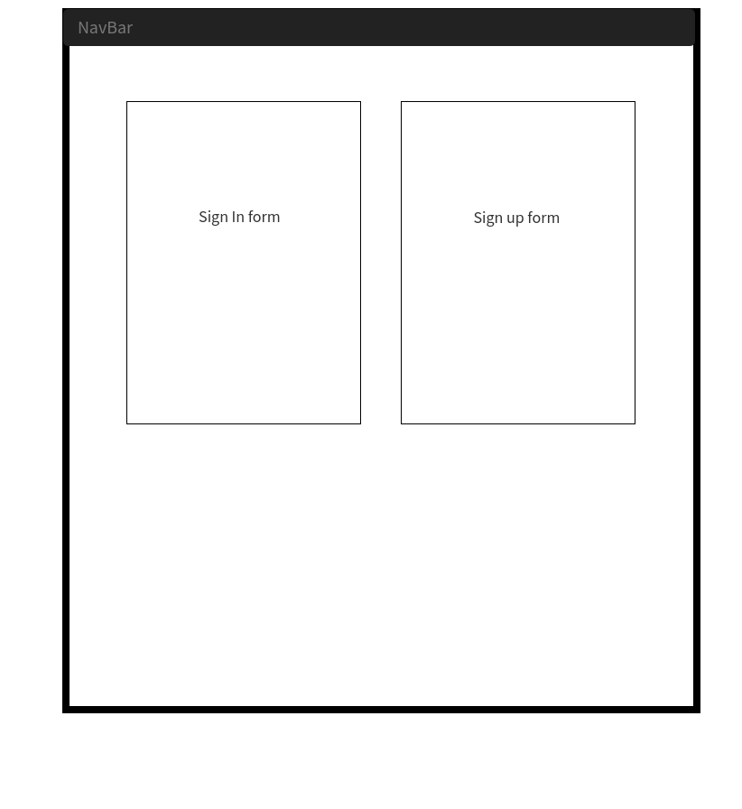
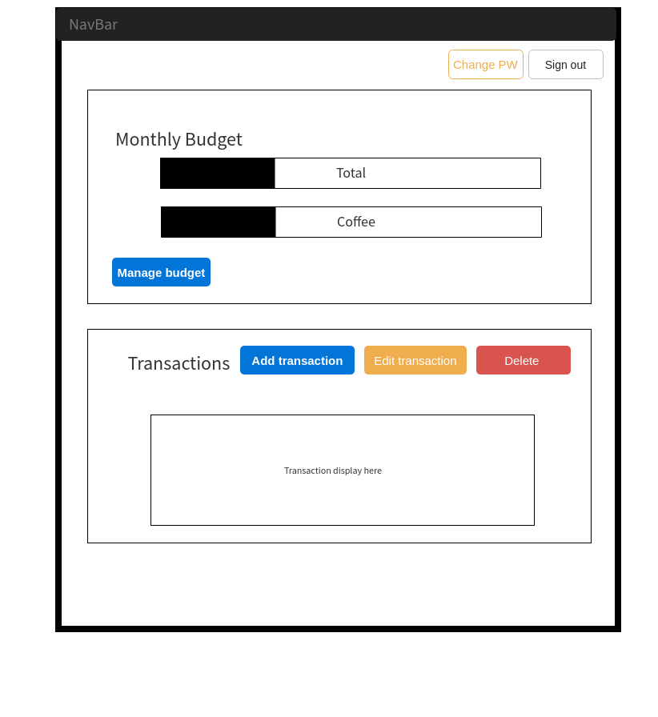

# Finance management tracker - Front-end Client

## App Summary
A financial management app that currently allows the user to have personalized transactions that they can input to track. It displays all your transactions in list format, complete with date, amount, currency and description of the transaction.

***Transaction actions currently supported:***
- Refresh (list) transactions
- Create
- Edit
- Delete

## Links
**Deployed front-end client:** https://marcpelve.github.io/front-end-finance-tracker/

**Front-end client repository:** https://github.com/marcpelve/front-end-finance-tracker

**Deployed back-end API:** https://protected-castle-96334.herokuapp.com

**Back-end API repository:** https://github.com/marcpelve/back-end-finance-tracker

## Technologies
HTML5, CSS3, SASS, Bootstrap

JavaScript, jQuery, Handlebars.js

NodeJS, GruntJS

## Development documentation

### Wireframes && User stories

Wireframes

User stories

As a user, I want to be able to sign in.
As a user, I want to be able to log in.
As a user, I want to be able to change passwords.
As a user, I want to be able to sign out.

As a user, I want to be able to see all my transactions.
As a user, I want to be able to create a transaction.
As a user, I want to be able to edit a transaction.
As a user, I want to be able to delete a transaction.
As a user, I want to be able to set a budget.
As a user, I want to see a very basic budget analysis of the month.

### Client - Front-end
##### Setup and intialize to local/remote and Git Pages
Install dependencies and work with locally with Grunt
- Use `npm` to install dependencies
- Use `grunt` to deploy to Git Pages

##### Structure planning - Linking to API
Link to API resource and use for protected transactions
- `User` resource requests for authentication
- `Expense` resource to be used as transactions listing
  - Protected resource will require authorization token

  `Users` -|--< `Expenses`

  **Expenses** belong to **User**

  **User** has many **Expenses**

  <table style="display:inline">
  <th colspan="2" style="text-align:center">Expenses</th>
  <th colspan="2" style="text-align:center">User</th>
  <tr>
  <td>id</td>
  <td>primary key</td>
  <td>id</td>
  <td>primary key</td>
  </tr>
  <tr>
  <td>amount</td>
  <td>integer</td>
  <td>email</td>
  <td>string</td>
  </tr>
  <tr>
  <td>currency</td>
  <td>string</td>
  <td>password</td>
  <td>string</td>
  </tr>
  <tr>
  <td>description</td>
  <td>string</td>
  <td>password_confirmation</td>
  <td>string</td>
  </tr>
  <tr>
  <td>user_id</td>
  <td>foreign key</td>
  <td></td>
  <td></td>
  </tr>
  <tr>
  <td>transaction_date</td>
  <td>date</td>
  <td></td>
  <td></td>
  </tr>
  <tr>
  <td>created_at</td>
  <td>datetime</td>
  <td>created_at</td>
  <td>datetime</td>
  </tr>
  <tr>
  <td>updated_at</td>
  <td>datetime</td>
  <td>updated_at</td>
  <td>datetime</td>
  </tr>
  </table>

##### Data Display
Use handlebars and jQuery to dynamically display data
- Handles bars to be used for main transcation listing

##### End Point Testing
Create curl scripts to test routing and resource end points

<ul style="list-style-type:none;">
  <li>get -> #index, #show<li>
  <li>post -> #create</li>
  <li>patch -> #update</li>
  <li>delete -> #destroy</li>
</ul>

### Project problem realizations
Early on I realized the budget creation and using the transaction info to provide a full fledged financial management app experience was not going to be possible in the given time frame. I quickly pivoted and made arrangements to move that area to be future implementations for the app. 

#### Potential updates
1. Resource `profile` with to allow more constraints for data manipulation
2. Use profile resource to allow budget manipulation and representation with JS
3. Create search bar and link to API search action for better data display
3. Make requests to 3rd party API for more app functionality
